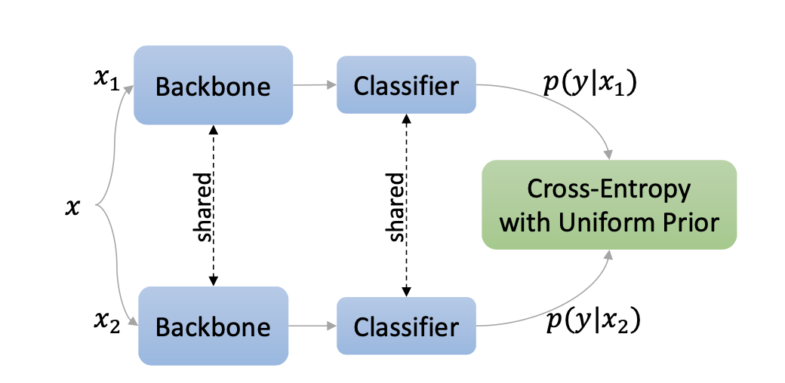
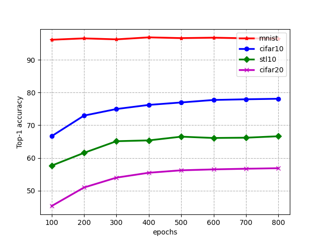
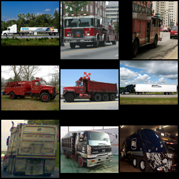
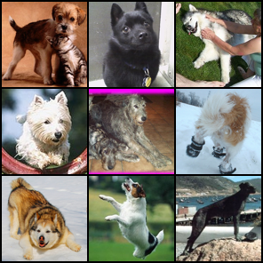
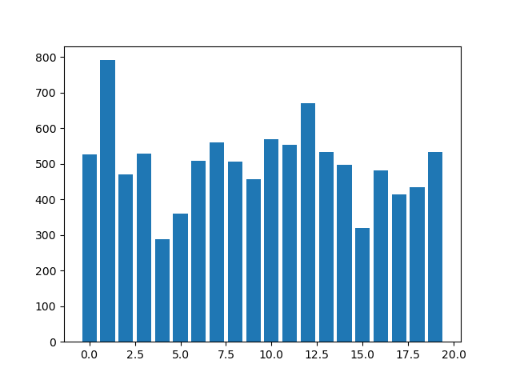
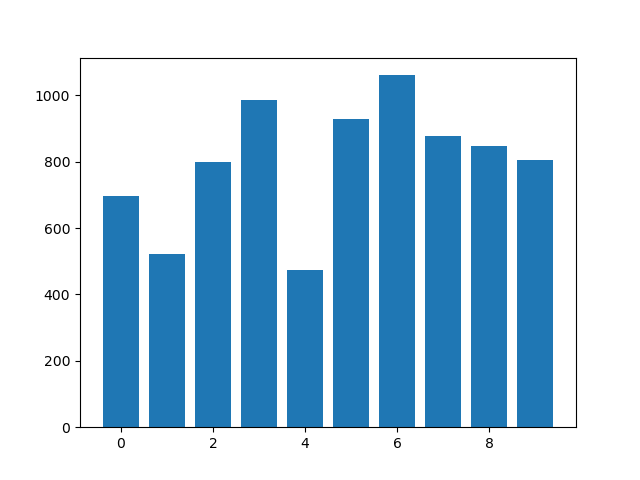
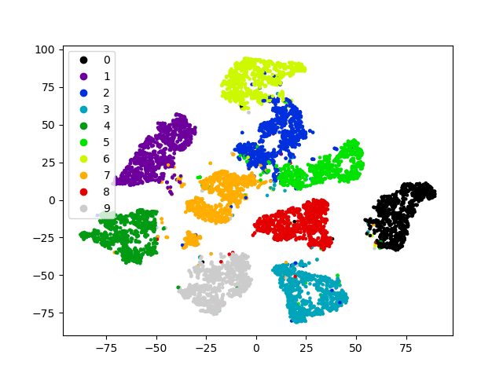
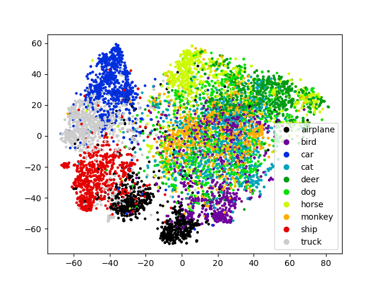

# Self-Classifier
DD2412 Final Project

Reimplementation of [Self-Supervised Classification Network](https://arxiv.org/abs/2103.10994)

The implementation part of the project was especially handled by [Shaochen Bai](https://gits-15.sys.kth.se/shaochen).

## Unsupervised training

1. Check the configurate files for each task in [./configs](./configs)
2. Run the following command: (stl10 for example)

    `python train.py -c configs/stl10.yaml`

## Linear probing

1. The pretrained model from unsupervised learning should be saved in ./save_[DATASET_NAME]/ 
(replace [DATASET_NAME] with the dataset your are using)
2. Run the following command:

    `python linear_probing.py -c configs/linear_stl10.yaml -f save_stl10/`

The Top-1 and Top-3 supervised results are in align with the unsupervised results:

 | 

## Visualization

1. Determine which saved model to visualize
2. Run the following command:

    `python visualize.py -c configs/stl10.yaml -f save_stl10/resnet18_800.pth`

The visualization output include clustering examples(high and low accuracy examples of stl10 clusters):

 | 

Bar chart on prediction classes (cifar20 and stl10 prediction):

 | 

And T-SNE visualization on the extracted features (mnist and cifar10):

 | 

---
## Note
1. More visualized results can be found in [./imgs](./imgs)

